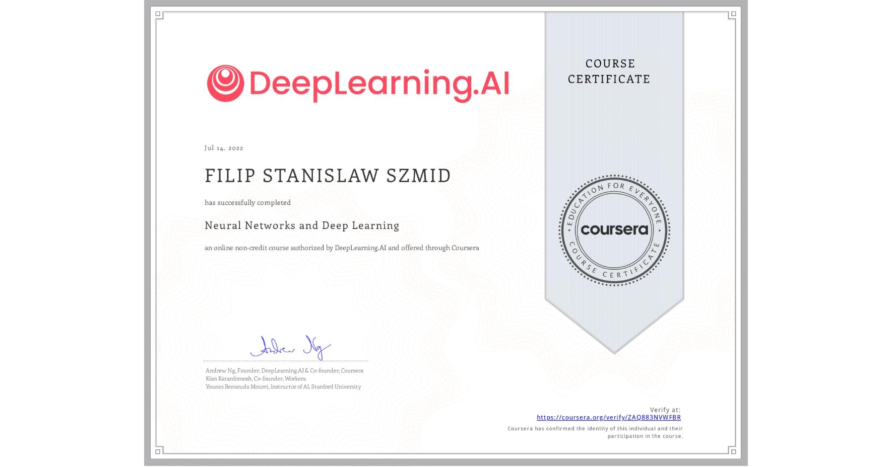
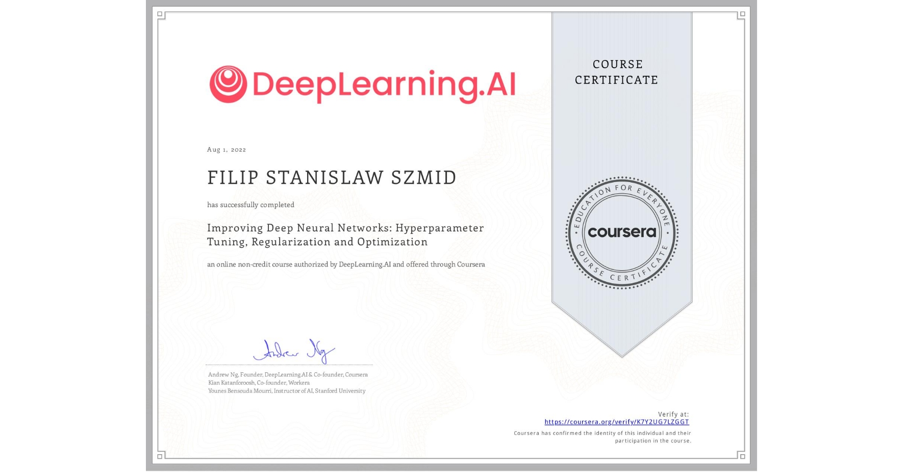
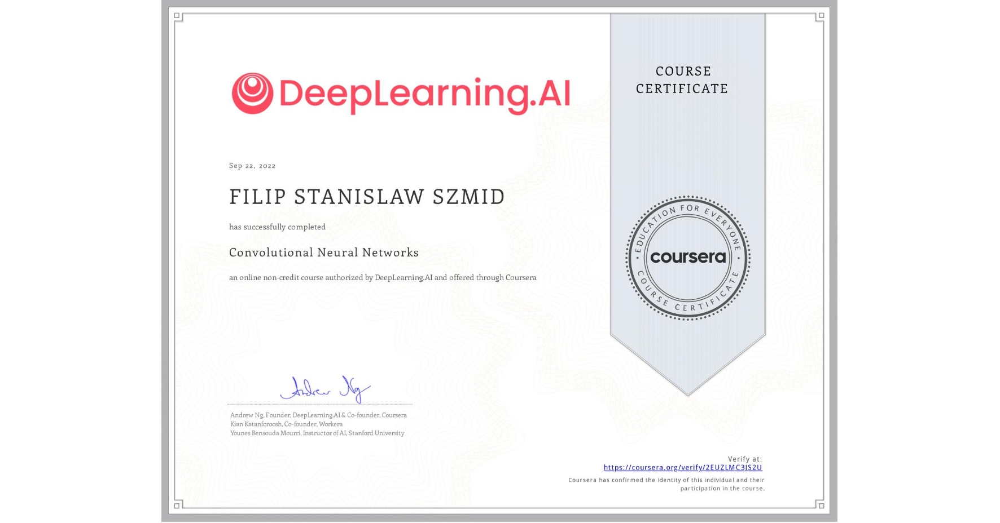
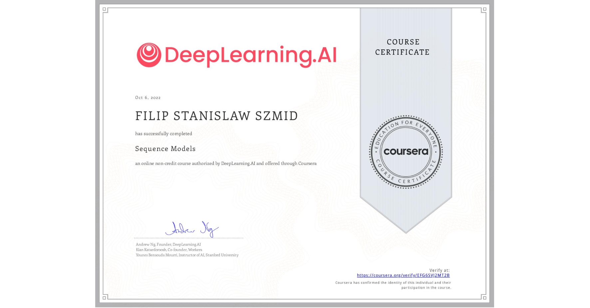
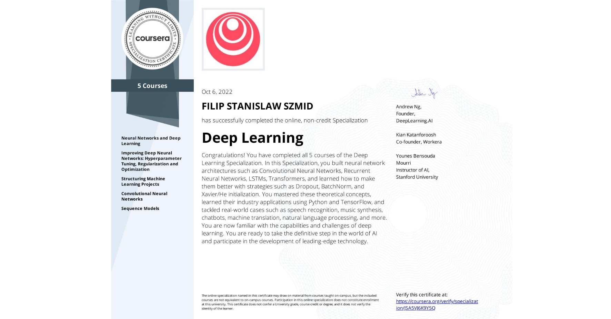

# Deep-Learning
This is repository with solutions to the whole Deep Learning Specialization course.
Specialization contains series of 5 courses.

## Technologies
- tensorflow
- keras
- numpy
- matplotlib
- time
- random
- pandas
- transformers
- re
- pandas
- pytorch

## Programming Assignments

### Course 1: Neural Networks and Deep Learning
  - [2.1. Logistic Regression as a Neural Network](https://github.com/Filip-231/Deep-Learning/blob/master/Neural%20Networks%20and%20Deep%20Learning/Week%202/Logistic%20Regression%20as%20a%20Neural%20Network/Logistic_Regression_with_a_Neural_Network_mindset_v6a.ipynb)
  - [2.2. Python Basics with Numpy](https://github.com/Filip-231/Deep-Learning/blob/master/Neural%20Networks%20and%20Deep%20Learning/Week%202/Python%20Basics%20with%20Numpy/Python_Basics_With_Numpy_v3a.ipynb)
  - [3.1. Planar data classification with one hidden layer](https://github.com/Filip-231/Deep-Learning/blob/master/Neural%20Networks%20and%20Deep%20Learning/Week%203/Planar%20data%20classification%20with%20one%20hidden%20layer/Planar_data_classification_with_onehidden_layer.ipynb)
  - [4.1. Building your Deep Neural Network-Step by Step](https://github.com/Filip-231/Deep-Learning/blob/master/Neural%20Networks%20and%20Deep%20Learning/Week%204/Building%20your%20Deep%20Neural%20Network%20-%20Step%20by%20Step/Building_your_Deep_Neural_Network_Step_by_Step_v8a.ipynb)
  - [4.2. Deep Neural Network Application Image Classification](https://github.com/Filip-231/Deep-Learning/blob/master/Neural%20Networks%20and%20Deep%20Learning/Week%204/Deep%20Neural%20Network%20Application_%20Image%20Classification/Deep%20Neural%20Network%20-%20Application%20v8.ipynb)

### Course 2: Improving Deep Neural Networks: Hyperparameter tuning, Regularization and Optimization

  - [1.1. Initialization](https://github.com/Filip-231/Deep-Learning/blob/master/Improving%20Deep%20Neural%20Networks%20Hyperparameter%20tuning%2C%20Regularization%20and%20Optimization/Week%201/Initialization/Initialization.ipynb)
  - [1.2. Regularization](https://github.com/Filip-231/Deep-Learning/blob/master/Improving%20Deep%20Neural%20Networks%20Hyperparameter%20tuning%2C%20Regularization%20and%20Optimization/Week%201/Regularization/Regularization_v2a.ipynb)
  - [1.3. Gradient Checking](https://nbviewer.jupyter.org/github/amanchadha/coursera-deep-learning-specialization/blob/master/C2%20-%20Improving%20Deep%20Neural%20Networks%20Hyperparameter%20tuning%2C%20Regularization%20and%20Optimization/Week%201/Gradient%20Checking/Gradient%20Checking%20v1.ipynb)
  - [2. Optimization Methods](https://github.com/Filip-231/Deep-Learning/blob/master/Improving%20Deep%20Neural%20Networks%20Hyperparameter%20tuning%2C%20Regularization%20and%20Optimization/Week%202/Optimization_methods_v1b.ipynb)
  - [3. TensorFlow Tutorial](https://github.com/Filip-231/Deep-Learning/blob/master/Improving%20Deep%20Neural%20Networks%20Hyperparameter%20tuning%2C%20Regularization%20and%20Optimization/Week%203/Tensorflow_introduction.ipynb)

### Course 3: Structuring Machine Learning Projects

  - There was no programming assignments for this course. It contains interesting case study quizzes.
  
### Course 4: Convolutional Neural Networks
  - [1. Convolution model Step by Step](https://github.com/Filip-231/Deep-Learning/blob/master/Convolutional%20Neural%20Networks/Week%201/Convolution_model_Step_by_Step_v1.ipynb)
  - [2. Residual Networks](https://github.com/Filip-231/Deep-Learning/blob/master/Convolutional%20Neural%20Networks/Week%202/ResNets/Residual_Networks.ipynb)
  - [3.1. Autonomous driving application Car detection.](https://github.com/Filip-231/Deep-Learning/blob/master/Convolutional%20Neural%20Networks/Week%203/Car%20detection%20for%20Autonomous%20Driving/Autonomous_driving_application_Car_detection.ipynb)
  - [3.2. Image segmentation Unet](https://github.com/Filip-231/Deep-Learning/blob/master/Convolutional%20Neural%20Networks/Week%203/Image%20Segmentation%20Unet/Image_segmentation_Unet_v2.ipynb)

### Course 5: Sequence Models

  - [1.1. Building a Recurrent Neural Network - Step by Step](https://github.com/Filip-231/Deep-Learning/blob/master/Sequence%20Models/Week%201/Building%20a%20Recurrent%20Neural%20Network%20-%20Step%20by%20Step/Building_a_Recurrent_Neural_Network_Step_by_Step.ipynb)
  - [1.2. Dinosaur Land - Character-level Modeling](https://github.com/Filip-231/Deep-Learning/blob/master/Sequence%20Models/Week%201/Dinosaur%20Island%20--%20Character-level%20language%20model/Dinosaurus_Island_Character_level_language_model.ipynb)
  - [1.3. Jazz improvisation with LSTM](https://github.com/Filip-231/Deep-Learning/blob/master/Sequence%20Models/Week%201/Jazz%20improvisation%20with%20LSTM/Improvise_a_Jazz_Solo_with_an_LSTM_Network_v4.ipynb)
  - [2.1. Word Vector Representation and Debiasing](https://github.com/Filip-231/Deep-Learning/blob/master/Sequence%20Models/Week%202/Word%20Vector%20Representation/Operations%20on%20word%20vectors%20-%20v2.ipynb)
  - [2.2. Emojify!](https://github.com/Filip-231/Deep-Learning/blob/master/Sequence%20Models/Week%202/Emojify/Emojify%20-%20v2.ipynb)
  - [3.1 Neural Machine Translation with Attention](https://github.com/Filip-231/Deep-Learning/blob/master/Sequence%20Models/Week%203/Machine%20Translation/Neural%20machine%20translation%20with%20attention%20-%20v4.ipynb)
  - [3.2. Trigger Word Detection](https://github.com/Filip-231/Deep-Learning/blob/master/Sequence%20Models/Week%203/Trigger%20word%20detection/Trigger%20word%20detection%20-%20v1.ipynb)
  - [4.1. Transformer Network](https://github.com/Filip-231/Deep-Learning/blob/master/Sequence%20Models/Week%204/Transformer%20Network/C5_W4_A1_Transformer_Subclass_v1.ipynb)
  - [4.2. Named-Entity Recognition](https://github.com/Filip-231/Deep-Learning/blob/master/Sequence%20Models/Week%204/Named%20Entity%20Recognition/Transformer_application_Named_Entity_Recognition.ipynb)

[//]: # (  - [4.3. Question Answering]&#40;https://github.com/Filip-231/Deep-Learning/blob/master/Sequence%20Models/Week%204/Question%20Answering/QA_transformer.ipynb&#41;)

# My Certifications
### 1. Neural Networks and Deep Learning.

### 2. Improving Deep Neural Networks: Hyperparameter Tuning, Regularization and Optimization.

### 3. Structuring Machine Learning Projects.

### 4. Convolutional Neural Networks.

### 5. Sequence models - speech recognition, music synthesis, chatbots, machine translation, NLP.

### Deep Learning specialization.
